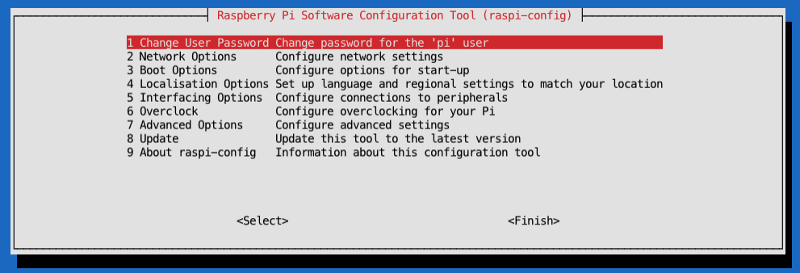

# Confluent Platform on Raspberry PI 4 

I am a heavy user of iPad Pro in my business. One thing I really miss is the not availability of having something to work with Kafka, Python, docker etc. on my iPad. I would really cool to just use my iPad for making demos and presentations at customers.
So, I saw a nice video on [youtube](https://youtu.be/IR6sDcKo3V8), which shows how to connect a Raspberry PI with your iPad with just the USB-C cable coming with iPad.
Having an iPad and small box of Raspberry PI would real a nice feature for demo around.


## Prepare Raspberry PI

I bought a Raspberry PI with SD-Card (64GB), Box and some cooling tools. There are lots of kits out there.
I copied an image [Raspbian Buster Lite](https://www.raspberrypi.org/downloads/raspbian/) on my Mac.
There is tool outside to prepare the image for iPad Pro USB support.I used to pre-config the image:
```bash
cd /Users/cm/raspberry
git clone https://github.com/hardillb/rpi-gadget-image-creator.git
cd rpi-gadget-image-creator/
```
This tool uses the downloaded image for IPad, pre-configured it and overwrite the original.
```bash
./create-image 2020-02-13-raspbian-buster-lite.img
```
What does this tool:
* Create Image for USB-C support
* Image pre-configured host for IP 10.55.0.1, raspberrypi and raspberrypi.local
* SSH is enabled
* all Updates are completed

Instead you can use [this guide](https://www.hardill.me.uk/wordpress/2019/11/02/pi4-usb-c-gadget/) to configure manually.   

Now I used [Balena Etcher](https://www.balena.io/etcher/) on my Mac to write the image to the SC-Card.
If you plu the SDCard into your RaspBerry PI, plug-in network cable and Power then you can log-in without keyboard.
Just login via SSH with standard username: pi and password: raspberry
```bash
ssh pi@raspberrypi
```
Voila, Raspberry PI is up running. Now you have configure some important things:
* change password
* expand the storage
For this you will use raspi-config, first change the password (1), then expand the storage under Advanced Options(7)(A1):

```bash
df -k
sudo raspi-config
df -k
```
Now, you have the complete storage enabled and your own password. It's time to setup the Demo Environment and do a reboot.
```bash
sudo reboot
```

## Setup Confluent Platform on Raspberry PI
Login again to raspberry pi with new password:
```bash
ssh pi@raspberrypi
```
Install all the tools we need to enable Confluent Platform:
```bash
sudo apt-get install openjdk-8-jre 
sudo apt install curl
# install docker
curl -sSL https://get.docker.com | sh
sudo usermod -aG docker pi
exit
```
Login again so that docker is enabled for pi user:
```bash
ssh pi@raspberrypi
```
and check docker and continue installtion:
```bash
docker run hello-world
sudo apt-get install -y libffi-dev libssl-dev
sudo apt-get install -y python3 python3-pip
sudo apt-get remove python-configparser
sudo pip3 install docker-compose
/usr/local/bin/docker-compose --version
python3 --version
```
Now, it is time for Confluent Platform and missing tools:
```bash
sudo apt-get install jq
mkdir -p /home/pi/software
cd /home/pi/software
wget http://packages.confluent.io/archive/5.4/confluent-5.4.1-2.12.zip
unzip confluent-5.4.1-2.12.zip
rm confluent-5.4.1-2.12.zip
mv confluent-5.4.1 confluent/
```
Add some parameters into /home/pi/.bashrc:
```bash
# add 
export PATH=$PATH:/usr/local/bin:/home/pi/software/confluent/bin
export CONFLUENT_HOME=/home/pi/software/confluent
export JAVA_HOME=/usr/lib/jvm/java-8-openjdk-armhf/
# source
. .bashrc
# save and source .bashrc
```
Then I created to scripts. One to start the Confluent Platform (Zookeeper and Broker) and another one to stop the cluster
```bash
vi start.sh
$CONFLUENT_HOME/bin/zookeeper-server-start -daemon $CONFLUENT_HOME/etc/kafka/zookeeper.properties
$CONFLUENT_HOME/bin/kafka-server-start -daemon $CONFLUENT_HOME/etc/kafka/server.properties
#$CONFLUENT_HOME/bin/kafka-rest-start -daemon $CONFLUENT_HOME/etc/kafka-rest/kafka-rest.properties
$CONFLUENT_HOME/bin/ksql-server-start -daemon $CONFLUENT_HOME/etc/ksql/ksql-server.properties
# save start.sh
vi stop.sh
#$CONFLUENT_HOME/bin/kafka-rest-stop $CONFLUENT_HOME/etc/kafka-rest/kafka-rest.properties
$CONFLUENT_HOME/bin/ksql-server-stop $CONFLUENT_HOME/etc/ksql/ksql-server.properties
$CONFLUENT_HOME/bin/kafka-server-stop $CONFLUENT_HOME/etc/kafka/server.properties
$CONFLUENT_HOME/bin/zookeeper-server-stop $CONFLUENT_HOME/etc/kafka/zookeeper.properties
# save stop.sh
# Finally make script executable
chmod u+x start.sh 
chmod u+x stop.sh 
```

Unfortunately Raspberry has not enough power to run more components. Also Docker images from Confluent for linux/armv7 is not given. And even the ccloud cli do not support linux/armv7.

Finally I created some alias to make life easier. I did add the following commands into .bashrc:
```bash
alias listtopics='kafka-topics --bootstrap-server raspberrypi:9092 --list'
alias createtopic='kafka-topics --bootstrap-server raspberrypi:9092 --create --partitions 1 --replication-factor 1 --topic'
alias produce='kafka-console-producer --broker-list raspberrypi:9092 --topic'
alias consume='kafka-console-consumer --bootstrap-server raspberrypi:9092 --from-beginning --topic'
```
## Last Steps for my iPad
Confluent Platform and some other tools are installed. If you plug now RaspBerry PI via Apple USB-C to your iPad then small server is starting and you can login into this in couple of seconds.
For this you need a tool, a ssh client on iPad. There a couple tools out there and I use [termius](https://termius.com/ios). I do have this app since year, and do not remember if I did pay for that.

The config of this app is straight forward, nothing special.

The next thiing is that I want to use the hotspot of my iPad if I am outside of office. That's why I have to confugire wlan.
```bash
sudo vi /etc/wpa_supplicant/wpa_supplicant.conf
ctrl_interface=DIR=/var/run/wpa_supplicant GROUP=netdev
update_config=1
country=DE
network={
        ssid="Name of ylur iPad Pro"
        psk="password of your hotspot"
        key_mgmt=WPA-PSK
        priority=1
        id_str="Mobil"
}
```
And the last thing coming from [Tech Craft](https://youtu.be/SPSlyqo5Q2Q). He mentioned to create shortcuts into your iPad to
* stop the reaspberry pi (sudo shutdown -h down) per short cut [see](https://www.icloud.com/shortcuts/ac9bc8fafc48436c8f824513e8fc9763)
* to enable wlan0 for your iPad via short cut [see](https://www.icloud.com/shortcuts/360c5a095bb64bc6b6097de865fce569c)

That's it, happy demoing:
Plug-in the USBC cable into your Raspberry PI connect it with your iPad. It takes some seconds and the server is up and running and connected to your iPad hotspot:
```bash
ssh pi@10.55.0.1 via termius
./start.sh
listtopics
createtopic cmtest
produce cmtest
>First test
# close with CTRL+c
consume cmtest
First test
# close with CTRL+c
./stop.sh
```

To stop use the short cut or doing a `shutdown -h now`.

That's all. Some python tools and maybe supported arm docker images around kafka will follow.


