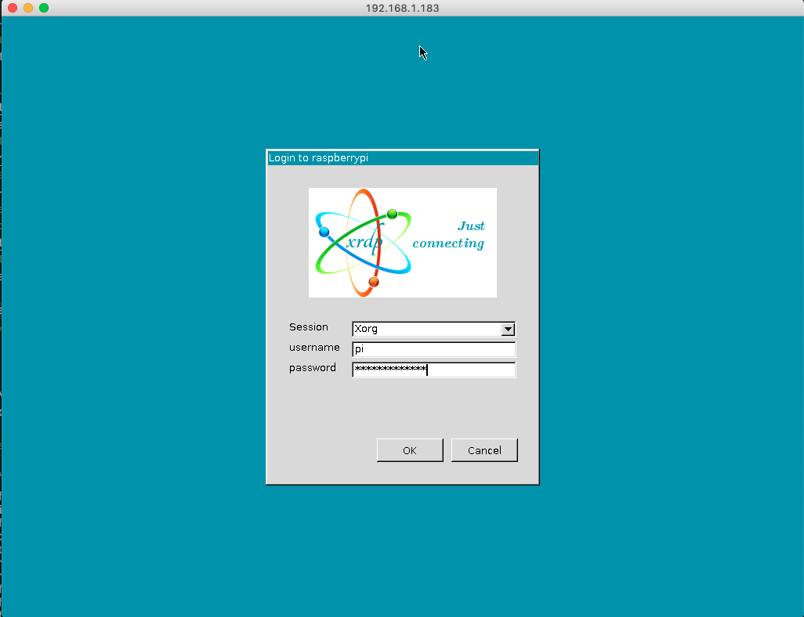

# Confluent Platform on Raspberry PI 4 

I am a heavy user of iPad Pro in my business. One thing I really miss is the non-availability of having an environment to work with Kafka, Python, docker etc. on my iPad. I would like to just use my iPad for making demos and presentations.
I saw a nice video on [youtube](https://youtu.be/IR6sDcKo3V8), which shows how to connect a Raspberry PI with an iPad with just the IPad USB-C cable.
Having an iPad with a small box of Raspberry PI besides would really generate a perfect demo experience.


This project is about:
* Prepare a [Raspberry PI 4GB](https://www.amazon.de/exec/obidos/ASIN/B07W7Q6ZC9/wwwkgpraxide-21/302-1468163-8034405) for your iPad and be connectable with USB-cable. No power necessary and iPad Pro Personal Hotspot using as WLAN in Raspberry PI.
* [Confluent Platform 5.4.1](https://www.confluent.io/product/confluent-platform/) running on Raspberry PI: Zookeeper, Kafka Broker and KSQL
* Possibility to connect to Confluent Cloud cluster
* and a couple of tools like kafka tools, java, python, docker, docker-compose, kafkacat, terraform, tcpdump, tshark and whatever you want

Unfortunately not everything is running on Raspberry hardware e.g.:
* Confluent docker images, confluent cli, confluent cloud cli do not support arm hardware
* you can not run all components of the Confluent Platform because of limited resources

## Prepare Raspberry PI

I bought a Raspberry PI 4 4GB with a SD-Card (64GB), Box and some cooling tools. There are lots of kits out there.
I downloaded [Raspbian Buster Lite](https://www.raspberrypi.org/downloads/raspbian/) image on my Mac. You can install the image directly to the SDCard, but there is tool to prepare the image for iPad Pro USB support. I used this to pre-config the image with one command:
```bash
cd /Users/cm/raspberry
git clone https://github.com/hardillb/rpi-gadget-image-creator.git
cd rpi-gadget-image-creator/
```
After having this available on your Mac, the downloaded can be pre-configured for iPad Pro USB support and will overwrite the original image.
```bash
./create-image 2020-02-13-raspbian-buster-lite.img
```
What does this tool:
* Create Image for USB-C support
* Image pre-configured host for IP 10.55.0.1, raspberrypi and raspberrypi.local
* SSH is enabled
* all Updates are installed

Instead of having a tool to prepare the image, you can copy the downloaded image to SDCard and use [this guide](https://www.hardill.me.uk/wordpress/2019/11/02/pi4-usb-c-gadget/) to configure manually.   

The empty SDCard is connected with a USB-Adapter to my Mac. For copying the image to SDCard I used [Balena Etcher](https://www.balena.io/etcher/) on my Mac. This tool copies images to SDCard. Now, you can plug-in the prepared SDCard into your Raspberry PI, plug-in network cable and switch-on the Power. Wait a couple second you can log-in without keyboard.

Trial connect raspberry with LAN cable
Just login via SSH with standard username: pi and password: raspberry
```bash
ssh pi@raspberrypi
sudo raspi-config
  # Localisation Options -> Set Wi-Fi country
  exit
```
Trial connect raspberry with iPad/iPhone personal HotSpot
If you plug-in the raspberry pi with USB-C cable to your iPad. You will see under System preferences a new Ethernet entry. This shows that Raspberry is connected perfectly. Downlad a SSH Client App and try to connect. There are couple of tools out there and I use [termius](https://termius.com/ios). I do have this app since years, and do not remember if I did pay for that.

The config of this app is straight forward, nothing special.
Login with ssh client APP with user pi, password: raspberry, Host raspberry.local

The next thing is that I want to use the hotspot of my iPad if I am outside. That's why I have to configure wlan.
```bash
# Check if you see your Hotspot
sudo iwlist wlan0 scan
# Add the hotspot
sudo vi /etc/wpa_supplicant/wpa_supplicant.conf
ctrl_interface=DIR=/var/run/wpa_supplicant GROUP=netdev
update_config=1
country=DE
network={
        ssid="Name of your iPPhone"
        psk="password of your hotspot"
        key_mgmt=WPA-PSK
#        scan_ssid=1   # if you run hidden networks
}
# save
sudo cd /etc/network/interfaces.d/
sudo cp usb0 wlan0
sudo vi wlan0 # change to 
allow-hotplug wlan0
iface wlan0 inet static
    wpa-conf /etc/wpa_supplicant/wpa_supplicant.conf
    address 10.55.0.1
    netmask 255.255.255.248
#save
sudo wpa_cli -i wlan0 reconfigure
sudo ifdown wlan0
sudo ifup wlan0
# wlan0 should have now more inets
ip addr
ping amazon.de
# Debug
# /var/log/daemon.log
# /var/log/syslog
```
And the last thing coming from [Tech Craft](https://youtu.be/SPSlyqo5Q2Q). He mentioned to create shortcuts into your iPad to
* stop the raspberry pi (sudo shutdown -h now) per shortcut [see](https://www.icloud.com/shortcuts/ac9bc8fafc48436c8f824513e8fc9763)
* to enable wlan0 for your iPad via shortcut [see](https://www.icloud.com/shortcuts/360c5a095bb64bc6b6097de865fce569c)
Click on wlan Enable Button and connect via SSH client APP is internet is working on your Rasperry PI via iPad Personal Hotspot.

Voila, Raspberry PI is up running. Before doing the final preparation, just do first important steps:
* change password
* expand the storage
For this you will use raspi-config, first change the password (1), then expand the storage under Advanced Options(7)(A1):

```bash
df -k
sudo raspi-config
df -k
```
You have the complete storage enabled and set your own password. We checked the network access:
* USB-C cable access is working
* WLAN is working with iPhone
* LAN access via ethernet cable is also working
It's time to setup the Demo Environment and do a reboot.
```bash
sudo reboot
```

## Setup Tools and Confluent Platform on Raspberry PI
Login again to raspberry pi with new password and Internet access, via WLAN or LAN. I choose LAN Access and plug-in the ethernet into Raspberry PI:
```bash
ssh pi@raspberrypi
# check network
ifconfig
# shutdown WLAN for the setup time
sudo ifdown wlan0
# internet is working 
ping amazon.de
```
Install all the tools we need to enable Confluent Platform:
```bash
sudo apt install openjdk-8-jdk -y
sudo apt install curl -y
sudo apt-get install -y tcpdump tshark
# install docker
curl -sSL https://get.docker.com | sh
sudo usermod -aG docker pi
exit
```
Login again so that docker is enabled for pi user:
```bash
ssh pi@raspberrypi
```
Check docker and continue installation:
```bash
docker run hello-world
# Install more tools
sudo apt-get install -y libffi-dev libssl-dev
sudo apt-get install -y python3 python3-pip
sudo apt-get remove python-configparser
sudo pip3 install docker-compose
#check docker-compose and python
/usr/local/bin/docker-compose --version
python3 --version
```
Now, it is time for Confluent Platform and missing tools:
```bash
sudo apt-get install jq -y
mkdir -p /home/pi/software
cd /home/pi/software
wget http://packages.confluent.io/archive/5.4/confluent-5.4.1-2.12.zip
unzip confluent-5.4.1-2.12.zip
rm confluent-5.4.1-2.12.zip
mv confluent-5.4.1 confluent/
```
Add some parameters into /home/pi/.bashrc:
```bash
# add 
export CONFLUENT_HOME=/home/pi/software/confluent
export JAVA_HOME=/usr/lib/jvm/java-8-openjdk-armhf/
export PATH=$PATH:/usr/local/bin:$CONFLUENT_HOME/bin:$JAVA_HOME/bin:/home/pi/software
export KSQL_HEAP_OPTS="-Xms1G -Xmx2G"
export CONTROL_CENTER_HEAP_OPTS="-Xms1G -Xmx2G"

alias ll='ls -la'
alias listtopics='kafka-topics --bootstrap-server raspberrypi:9092 --list'
alias createtopic='kafka-topics --bootstrap-server raspberrypi:9092 --create --partitions 1 --replication-factor 1 --topic'
alias produce='kafka-console-producer --broker-list raspberrypi:9092 --topic'
alias consume='kafka-console-consumer --bootstrap-server raspberrypi:9092 --from-beginning --topic'

echo "######## Welcome to RASPBERRYPI ####################"
echo "# Start WLAN                                       #"
echo "#    sudo ifdown wlan0  # shutdown WLAN            #"
echo "#    sudo ifup wlan0    # bring up WLAN            #"
echo "#    ip addr                                       #"
echo "# You can do the following:                        #"
echo "#    start.sh    -- starts 1 ZK, 1KB               #"
echo "#      stop it with stop.sh                        #"
echo "#    start_ksql.sh    -- starts 1 KSQL Node        #"
echo "#      use ksql cli to connect                     #"
echo "#      stop it with stop_ksql.sh                   #"
echo "# Do Kafka:                                        #"
echo "#      createtopic <topic>                         #"
echo "#      listtopcis                                  #"
echo "#      produce <topic>                             #"
echo "#      consume <topic>                             #"
echo "# Do produce data                                  #"
echo "#    produceSyslog2Localcluster.sh                 #"
echo "#    produceTShard2Ccloud.sh                       #"
echo "########      HAVE FUN         #####################"
# save and source .bashrc
# source
. .bashrc
```
Then I created two scripts. One to start the Confluent Platform (Zookeeper and Broker) and another one will stop the cluster
```bash
vi start.sh
#!/bin/bash
export CONTROL_CENTER_HEAP_OPTS="-Xms1G -Xmx2G"
export KSQL_HEAP_OPTS="-Xms1G -Xmx2G"
$CONFLUENT_HOME/bin/zookeeper-server-start -daemon $CONFLUENT_HOME/etc/kafka/zookeeper.properties
echo "Zookeeper is starting...log under $CONFLUENT_HOME/logs/zookeeper.out"
sleep 10
nc -vz localhost 2181
$CONFLUENT_HOME/bin/kafka-server-start -daemon $CONFLUENT_HOME/etc/kafka/server.properties
echo "Kafka Broker is starting....log under $CONFLUENT_HOME/logs/server.log"
sleep 10
nc -vz localhost 9092
# save start.sh

vi stop.sh
#!/bin/bash
$CONFLUENT_HOME/bin/kafka-server-stop $CONFLUENT_HOME/etc/kafka/server.properties
echo "stopping kafka...."
sleep 10
$CONFLUENT_HOME/bin/zookeeper-server-stop $CONFLUENT_HOME/etc/kafka/zookeeper.properties
echo "stopping zookeeper..."
ps -ef | grep java
# save stop.sh
```
Finally make script executable
```bash
chmod u+x start.sh 
chmod u+x stop.sh 
```

Unfortunately Raspberry has not enough power to run more Confluent components. Also Docker images from Confluent for linux/armv7 is not given. And even the confluent and ccloud cli do not support linux/armv7.

## configure the Confluent Kafka cluster
I did some changes for my propteries files. Just copy the complete text into:
```bash
vi $CONFLUENT_HOME/etc/kafka/zookeeper.properties
dataDir=/home/pi/software/data/zookeeper
clientPort=2181
maxClientCnxns=0
admin.enableServer=false
# save changes

vi $CONFLUENT_HOME/etc/kafka/server.properties
broker.id=0
num.network.threads=2
num.io.threads=4
socket.send.buffer.bytes=102400
socket.receive.buffer.bytes=102400
socket.request.max.bytes=104857600
log.dirs=/home/pi/software/data/kafka-logs
num.partitions=1
num.recovery.threads.per.data.dir=1
offsets.topic.replication.factor=1
transaction.state.log.replication.factor=1
transaction.state.log.min.isr=1
log.retention.hours=1
log.segment.bytes=1073741824
log.retention.check.interval.ms=300000
zookeeper.connect=raspberrypi:2181
zookeeper.connection.timeout.ms=18000
confluent.support.metrics.enable=false
confluent.support.customer.id=anonymous
group.initial.rebalance.delay.ms=0
confluent.license.topic.replication.factor=1
confluent.metadata.topic.replication.factor=1
# save changes

mkdir -p /home/pi/software/data/zookeeper
mkdir -p /home/pi/software/data/kafka-logs
```
## prepare property file for KSQL to connect to confluent cloud
On my iPad I will work with Confluent Cloud. At least the kafka tools and KSQL should work from my iPad. First I need a properties file (change your CCloud settings):
```bash
# KSQL Config to CCLOUD
echo "# Configuration derived from template_delta_configs/example_ccloud_config
ksql.service.id=rpi
listeners=http://0.0.0.0:8088
ksql.internal.topic.replicas=3
ksql.logging.processing.rows.include = false
ksql.logging.processing.stream.auto.create = false
ksql.logging.processing.stream.name = KSQL_PROCESSING_LOG
ksql.logging.processing.topic.auto.create = false
ksql.logging.processing.topic.partitions = 6
ksql.logging.processing.topic.replication.factor = 6
ssl.endpoint.identification.algorithm=https
sasl.mechanism=PLAIN
request.timeout.ms=20000
retry.backoff.ms=500
security.protocol=SASL_SSL
bootstrap.servers=CCLOUD-BROKER:9092
sasl.jaas.config=org.apache.kafka.common.security.plain.PlainLoginModule required username=\"CCLOUD-API-KEY\" password=\"CCLOUD-API_SECRET\";
basic.auth.credentials.source=USER_INFO
schema.registry.basic.auth.user.info=CCLOUDSR-APIKEY:CCLOUDSR-APISECRET
schema.registry.url=CCLOUDSR-URL
# Confluent Monitoring Interceptor specific configuration
confluent.monitoring.interceptor.ssl.endpoint.identification.algorithm=https
confluent.monitoring.interceptor.sasl.mechanism=PLAIN
confluent.monitoring.interceptor.security.protocol=SASL_SSL
confluent.monitoring.interceptor.bootstrap.servers=CCLOUD-BROKER:9092
confluent.monitoring.interceptor.sasl.jaas.config=org.apache.kafka.common.security.plain.PlainLoginModule required username=\"CCLOUD-API-KEY\" password=\"CCLOUD-API_SECRET\";
producer.interceptor.classes=io.confluent.monitoring.clients.interceptor.MonitoringProducerInterceptor
consumer.interceptor.classes=io.confluent.monitoring.clients.interceptor.MonitoringConsumerInterceptor
ksql.streams.producer.retries=2147483647
ksql.streams.producer.confluent.batch.expiry.ms=9223372036854775807
ksql.streams.producer.request.timeout.ms=300000
ksql.streams.producer.max.block.ms=9223372036854775807
ksql.streams.replication.factor=3
ksql.schema.registry.basic.auth.credentials.source=USER_INFO
ksql.schema.registry.basic.auth.user.info=CCLOUDSR-APIKEY:CCLOUDSR-APISECRET
ksql.schema.registry.url=CCLOUDSR-URL" > ccloud_ksql.properties
```
This is property file to run KSQL to Confluent Cloud. To make it easier I created two script for Start and Stop:
```bash
vi start_ksql.sh
#!/bin/bash
export KSQL_HEAP_OPTS="-Xms1G -Xmx2G"
ksql-server-start -daemon ./ccloud_ksql.properties
# save changes

vi stop_ksql.sh
#/bin/bash
ksql-stop ./ccloud_ksql.properties
ksql-server-stop ./ccloud_ksql.properties
ps -ef | grep java
# save changes

# make scripts executable
chmod u+x start_ksql.sh
chmod u+x stop_ksql.sh
```

## Install kafkacat to produce data
Kafkacat installation documentation can be found [here](https://github.com/edenhill/kafkacat):
```bash
# install 
sudo apt-get install kafkacat -y
# create .ccloudenv file and add your parameters for confluent cloud
vi .ccloudenv
CCLOUD_BROKER_HOST=CCLOUD-BROKER # without Port
CCLOUD_API_KEY=API-KEY
CCLOUD_API_SECRET=API-SECRET
# save changes 

# Source file
source .ccloudenv 
# describe confluent cloud cluser
kafkacat -X security.protocol=SASL_SSL -X sasl.mechanisms=PLAIN -X api.version.request=true \
            -b ${CCLOUD_BROKER_HOST}:9092 \
            -X sasl.username="${CCLOUD_API_KEY}" \
            -X sasl.password="${CCLOUD_API_SECRET}" \
            -L
```
## Install terraform
Also this nice tool is very useful. You can have a lot of projects starting from here via terraform into cloud provider. e.g.
* [Single Node Confluent Cluster in AWS](https://github.com/ora0600/cpe53-singlenodeonaws)
* or other projects

The installation of terraform is very straight forward:
```bash
cd ~/software
wget https://releases.hashicorp.com/terraform/0.12.24/terraform_0.12.24_linux_arm.zip
unzip terraform_0.12.24_linux_arm.zip
rm terraform_0.12.24_linux_arm.zip
# test terraform
terraform version
```

## More Apps, for a better iPad Developer experience
It is time to think about a GUI Interface at my iPad to develop stuff. Visual Studio is my favorite tool for that.
Unfortunately I installed the lite Rasperian version of an image, that mean there is only a terminal prompt. But that is not a problem, we can upgrade [see](https://raspberrytips.com/upgrade-raspbian-lite-to-desktop/).
There a couple of different environments out there for the Raspberry PI. I took the Pixel Desktop developer by RPI org, it seems to be more stable.
Do the installation:
```bash
ssh pi@raspberrypi
sudo apt update
sudo apt upgrade
sudo apt dist-upgrade
sudo reboot
ssh pi@raspberrypi
sudo ifdown wlan0
sudo apt install xserver-xorg -y
sudo apt install raspberrypi-ui-mods -y
sudo apt install lightdm -y
sudo reboot
ssh pi@raspberrypi
sudo ifdown wlan0
```
Also, it would make sense to install some tools like Chrome and as I said Visual Studion next.
```bash
sudo apt install chromium-browser
```
It is time to install Visual Studio on Raspberry PI [see](https://pimylifeup.com/raspberry-pi-visual-studio-code/):
```bash
cd ~/software
# install the correct GPG keys
wget https://packagecloud.io/headmelted/codebuilds/gpgkey -O - | sudo apt-key add -
#install Visual Studio Code
curl -L https://raw.githubusercontent.com/headmelted/codebuilds/master/docs/installers/apt.sh | sudo bash
# done now, you need remote desktop control. You can start code at any time by calling "code-oss" within a terminal.
# Remote Desktop on RPI see https://pimylifeup.com/raspberry-pi-remote-desktop/
# install xrdp. The xrdp software replicates Microsoft’s RDP protocol so that other remote desktop clients can connect to your device. The software package even works with Microsoft’s own remote desktop client built into Windows.
sudo apt-get install xrdp -y
#check your IP adressses
hostname -I
```
If you work on your Mac there is still a remote Desktop App available, use it to connect the Rasbperry PI Desktop. For the iPad I recommend to use a VNC Viewer for iPad.
* APP VNC Viewer - Remote Desktop 
* or Microsoft Remote Desktop (this is my choice)

Login as PI user with your password. You will see only the terminal. Reboot and try it again an check browser, Visual Studio (Code OSS) and other graphical tools.

## Admin GUI for Raspberry PI
One important tool is still missing: PI Admin [see](https://pimylifeup.com/raspberry-pi-webmin/)
```bash
# we will need to install all the required packages of Webmin.
sudo apt-get install perl libnet-ssleay-perl openssl libauthen-pam-perl libpam-runtime libio-pty-perl apt-show-versions python -y
cd ~/software
wget http://prdownloads.sourceforge.net/webadmin/webmin_1.941_all.deb
sudo dpkg --install webmin_1.941_all.deb
rm webmin_1.941_all.deb
hostname -I
```
Open a brower via Remotedesktop and login via localhost wirh user pi and your password open [https://localhost:10000](https://localhost:10000)
Now, you have an WEB Admin GUI to control your Raspberry PI.

After all new installation tasks on my Raspberry PI there is still enough space on the SDCard(in my case 64GB), only 9% used storage. Maybe you save some money and just buy a 32GB SDCard.
```bash
df -k
Filesystem     1K-blocks    Used Available Use% Mounted on
/dev/root       61112892 4724284  53874140   9% /
devtmpfs         1867784       0   1867784   0% /dev
tmpfs            1999880   23012   1976868   2% /dev/shm
tmpfs            1999880    8716   1991164   1% /run
tmpfs               5120       4      5116   1% /run/lock
tmpfs            1999880       0   1999880   0% /sys/fs/cgroup
/dev/mmcblk0p1    258095   54399    203696  22% /boot
tmpfs             399976       8    399968   1% /run/user/1000
```
## Install Jupyter Notebook
To install Jupyter Notebook, do this at the command line on your Pi4:
```bash
sudo pip3 install jupyter
```
To start the Jupyter Notebook server on the Pi4, do this:
```bash
jupyter notebook
# save the URL
```
In your Raspberry Pi you can use the saved URL to connect to Jupyter Notebook

### To connect to the server from the Juno Connect app (11€):
Select Add Jupyter Server in the Juno Connect app
For Connection Settings choose Local port forwarding and not Direct connection. Using direct connection requires you to set up the Jupyter Notebook server with security certificates and such and is more complicated.
Enter the IP address of your Pi4 (in my case it’s 10.55.0.1) for the host and the port should be 22
For Authentication Settings, you can choose Password which is easier to set up, and fill up the rest of your credentials
Finally for the Port Forwarding Settings you should have localhost and 8888 as these are the defaults

## Happy Demoing

That's it, happy demoing:
Plug-in the USBC cable into your Raspberry PI connect it with your iPad. It takes some seconds and the server is up and running.
Check in System Privileges if you see the ethernet entry, then the server is connected.
Login via SSH client on iPad (in my case Termius);
 ``bash
ssh pi@10.55.0.1 via termius
# enable WLAN via iPhone
sudo ifdown wlan0
sudo ifup wlan0
./start.sh
listtopics
createtopic cmtest
produce cmtest
>First test
# close with CTRL+c
consume cmtest
First test
# close with CTRL+c
# Load data into the raspberry pi cluster with kafkacat from syslog
tail -f /var/log/syslog | kafkacat -b raspberrypi:9092 -t syslog -z snappy
./stop.sh
```

## Generate Data
Some examples how to generate data.
1. use tshark to get json data from your network and produce it into ccloud
```bash
source .ccloudenv 
sudo tshark -i usb0 \
            -T ek \
            -l \
            -e frame \
            -e ip.src \
            -e tcp.srcport \
            -e ip.dst \
            -e tcp.dstport | \
        grep timestamp | \
        jq --unbuffered -c '{timestamp: .timestamp} + .layers'  |\
        kafkacat -X security.protocol=SASL_SSL -X sasl.mechanisms=PLAIN -X api.version.request=true\
            -b ${CCLOUD_BROKER_HOST}:9092 \
            -X sasl.username="${CCLOUD_API_KEY}" \
            -X sasl.password="${CCLOUD_API_SECRET}" \
            -P \
            -t cmpcap \
            -T      
# Stop it with CTRL+c            
```

2. work with KSQL to check tshark data in ccloud
```bash
# work with KSQL
# Stop cluster before starting ksql
# start ksql server and connect to ccloud
./start_ksql.sql
# open ksql cli and do some queries
ksql
ksql> CREATE STREAM cmpcap_s, (timestamp BIGINT,frame VARCHAR, ip_src VARCHAR, tcp_srcport VARCHAR, ip_dst VARCHAR, tcp_dstport VARCHAR) WITH (KAFKA_TOPIC='cmpcap', VALUE_FORMAT='JSON');
ksql> list streams;
ksql> SET 'auto.offset.reset'='earliest';
ksql> select * from cmpcap_s emit changes;
ksql> drop stream CMPCAP_S;
ksql> exit;
./stop_ksql.sh
```

## Working with iPad Pro only and connected Raspberry PI

Now check your Raspberrry PI IP Adresses:
```bash
# get the local ip of raspberry pi
hostname -I
```
In wlan hotspot mode with Raspberry PI is using IP 10.55.0.1
Use the Remotedesktop APP on your mac and connect via IP. Enter user PI and your choosen Password.


Your trials:
* check ssh client access from iPad
* Check Remote Desktop access from iPad
    * start `jupyter notebook password` on Rasperry PI terminal windwo
* check Jupyter Access from iPad
* Play around with all tools

## Stopping the Raspberry PI
To stop the raspberry pi use the short cut or doing a `shutdown -h now`.

# Summary
That's all. A cool box with a couple of tools helping to demoing at cusatomer sites. Having a real developer environment where you can run developements in Trains, Plane, whereever...
There a couple of additional projects out there: Anaconda, and so much more.
In my case I would add anaconda, some python tools and maybe supported arm docker images around kafka.

So, happy coding...


