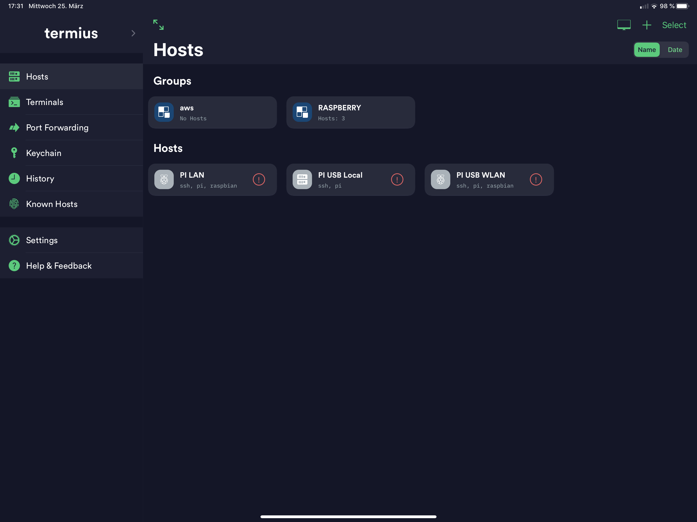

# Confluent Platform on Raspberry PI 4 

I am a heavy user of iPad Pro in my business. One thing I really miss is the non-availability of having an environment to work with Kafka, Python, docker etc. on my iPad. I would like to just use my iPad for making demos and presentations.
I saw a nice video on [youtube](https://youtu.be/IR6sDcKo3V8), which shows how to connect a Raspberry PI with an iPad with just the IPad USB-C cable.
Having an iPad with a small box of Raspberry PI besides would really generate a perfect demo experience.


This project is about:
* Prepare a [Raspberry PI 4GB](https://www.amazon.de/exec/obidos/ASIN/B07W7Q6ZC9/wwwkgpraxide-21/302-1468163-8034405) for your iPad and be connectable with USB-cable. No power necessary and iPad Pro Hotspot using as WLAN in Raspberry PI.
* [Confluent Platform 5.4.1](https://www.confluent.io/product/confluent-platform/) running on Raspberry PI: Zookeeper, Kafka Broker and KSQL
* Possibility to connect to Confluent Cloud cluster
* and a couple of tools like kafka tools, java, python, docker, docker-compose, kafkacat, terraform, tcpdump, tshark and whatever you want

Unfortunately not everything is running on Raspberry hardware e.g.:
* Confluent docker images, confluent cli, confluent cloud cli do not support arm hardware
* you can not run all components of the Confluent Platform because of limited resources

## Prepare Raspberry PI

I bought a Raspberry PI 4 4GB with a SD-Card (64GB), Box and some cooling tools. There are lots of kits out there.
I downloaded [Raspbian Buster Lite](https://www.raspberrypi.org/downloads/raspbian/) image on my Mac. You can install the image directly to the SDCard, but there is tool to prepare the image for iPad Pro USB support. I used this to pre-config the image with one command:
```bash
cd /Users/cm/raspberry
git clone https://github.com/hardillb/rpi-gadget-image-creator.git
cd rpi-gadget-image-creator/
```
After having this available on your Mac, the downloaded can be pre-configured for iPad Pro USB support and will overwrite the original image.
```bash
./create-image 2020-02-13-raspbian-buster-lite.img
```
What does this tool:
* Create Image for USB-C support
* Image pre-configured host for IP 10.55.0.1, raspberrypi and raspberrypi.local
* SSH is enabled
* all Updates are installed

Instead of having a tool you can copy the downloaded image to SDCard and use [this guide](https://www.hardill.me.uk/wordpress/2019/11/02/pi4-usb-c-gadget/) to configure manually.   

The empty SDCard is connected with a USB-Adapter to my Mac. For copying the image to SDCard I used [Balena Etcher](https://www.balena.io/etcher/) on my Mac. This tool copies images to SDCard. Now, you can plug-in the prepared SDCard into your Raspberry PI, plug-in network cable and switch-on the Power. Wait a couple second you can log-in without keyboard.
Just login via SSH with standard username: pi and password: raspberry
```bash
ssh pi@raspberrypi
```
Voila, Raspberry PI is up running. Before doing the final preparation, just do first important steps:
* change password
* expand the storage
For this you will use raspi-config, first change the password (1), then expand the storage under Advanced Options(7)(A1):

```bash
df -k
sudo raspi-config
df -k
```
You have the complete storage enabled and set your own password. It's time to setup the Demo Environment and do a reboot.
```bash
sudo reboot
```

## Setup Tools and Confluent Platform on Raspberry PI
Login again to raspberry pi with new password:
```bash
ssh pi@raspberrypi
```
Install all the tools we need to enable Confluent Platform:
```bash
sudo apt install openjdk-8-jdk
sudo apt install curl
sudo apt-get install -y tcpdump tshark
# install docker
curl -sSL https://get.docker.com | sh
sudo usermod -aG docker pi
exit
```
Login again so that docker is enabled for pi user:
```bash
ssh pi@raspberrypi
```
Check docker and continue installation:
```bash
docker run hello-world
sudo apt-get install -y libffi-dev libssl-dev
sudo apt-get install -y python3 python3-pip
sudo apt-get remove python-configparser
sudo pip3 install docker-compose
/usr/local/bin/docker-compose --version
python3 --version
```
Now, it is time for Confluent Platform and missing tools:
```bash
sudo apt-get install jq
mkdir -p /home/pi/software
cd /home/pi/software
wget http://packages.confluent.io/archive/5.4/confluent-5.4.1-2.12.zip
unzip confluent-5.4.1-2.12.zip
rm confluent-5.4.1-2.12.zip
mv confluent-5.4.1 confluent/
```
Add some parameters into /home/pi/.bashrc:
```bash
# add 
export CONFLUENT_HOME=/home/pi/software/confluent
export JAVA_HOME=/usr/lib/jvm/java-8-openjdk-armhf/
export PATH=$PATH:/usr/local/bin:$CONFLUENT_HOME/bin:$JAVA_HOME/bin:/home/pi/software

alias listtopics='kafka-topics --bootstrap-server raspberrypi:9092 --list'
alias createtopic='kafka-topics --bootstrap-server raspberrypi:9092 --create --partitions 1 --replication-factor 1 --topic'
alias produce='kafka-console-producer --broker-list raspberrypi:9092 --topic'
alias consume='kafka-console-consumer --bootstrap-server raspberrypi:9092 --from-beginning --topic'
# save and source .bashrc
# source
. .bashrc
```
Then I created to scripts. One to start the Confluent Platform (Zookeeper and Broker) and another one to stop the cluster
```bash
vi start.sh
export CONTROL_CENTER_HEAP_OPTS="-Xms1G -Xmx2G"
export KSQL_HEAP_OPTS="-Xms1G -Xmx2G"
$CONFLUENT_HOME/bin/zookeeper-server-start -daemon $CONFLUENT_HOME/etc/kafka/zookeeper.properties
echo "Zookeeper is starting...log under $CONFLUENT_HOME/logs/zookeeper.out"
sleep 10
nc -vz localhost 2181
$CONFLUENT_HOME/bin/kafka-server-start -daemon $CONFLUENT_HOME/etc/kafka/server.properties
echo "Kafka Broker is starting....log under $CONFLUENT_HOME/logs/server.log"
sleep 10
nc -vz localhost 9092
# save start.sh

vi stop.sh
$CONFLUENT_HOME/bin/kafka-server-stop $CONFLUENT_HOME/etc/kafka/server.properties
echo "stopping kafka...."
sleep 10
$CONFLUENT_HOME/bin/zookeeper-server-stop $CONFLUENT_HOME/etc/kafka/zookeeper.properties
echo "stopping zookeeper..."
ps -ef | grep java
# save stop.sh
```
Finally make script executable
```bash
chmod u+x start.sh 
chmod u+x stop.sh 
```

Unfortunately Raspberry has not enough power to run more Confluent components. Also Docker images from Confluent for linux/armv7 is not given. And even the confluent and ccloud cli do not support linux/armv7.

## configure the Confluent Kafka cluster
I did some changes for my propteries files. Just copy the complete text into:
```bash
vi $CONFLUENT_HOME/etc/kafka/zookeeper.properties
dataDir=/home/pi/software/data/zookeeper
clientPort=2181
maxClientCnxns=0
admin.enableServer=false
# save changes

vi $CONFLUENT_HOME/etc/kafka/server.properties
lbroker.id=0
num.network.threads=2
num.io.threads=4
socket.send.buffer.bytes=102400
socket.receive.buffer.bytes=102400
socket.request.max.bytes=104857600
log.dirs=/home/pi/software/data/kafka-logs
num.partitions=1
num.recovery.threads.per.data.dir=1
offsets.topic.replication.factor=1
transaction.state.log.replication.factor=1
transaction.state.log.min.isr=1
log.retention.hours=1
log.segment.bytes=1073741824
log.retention.check.interval.ms=300000
zookeeper.connect=raspberrypi:2181
zookeeper.connection.timeout.ms=18000
confluent.support.metrics.enable=false
confluent.support.customer.id=anonymous
group.initial.rebalance.delay.ms=0
confluent.license.topic.replication.factor=1
confluent.metadata.topic.replication.factor=1
# save changes

mkdir -p /home/pi/software/data/zookeeper
mkdir -p /home/pi/software/data/kafka-logs
```
## prepare property file for KSQL to connect to confluent cloud
On my iPad I will work with Confluent Cloud. At least the kafka tools and KSQL should work from my iPad. First I need a properties file (change your CCloud settings):
```bash
# KSQL Config to CCLOUD
echo "# Configuration derived from template_delta_configs/example_ccloud_config
ksql.service.id=rpi
listeners=http://0.0.0.0:8088
ksql.internal.topic.replicas=3
ksql.logging.processing.rows.include = false
ksql.logging.processing.stream.auto.create = false
ksql.logging.processing.stream.name = KSQL_PROCESSING_LOG
ksql.logging.processing.topic.auto.create = false
ksql.logging.processing.topic.partitions = 6
ksql.logging.processing.topic.replication.factor = 6
ssl.endpoint.identification.algorithm=https
sasl.mechanism=PLAIN
request.timeout.ms=20000
retry.backoff.ms=500
security.protocol=SASL_SSL
bootstrap.servers=CCLOUD-BROKER:9092
sasl.jaas.config=org.apache.kafka.common.security.plain.PlainLoginModule required username=\"CCLOUD-API-KEY\" password=\"CCLOUD-API_SECRET\";
basic.auth.credentials.source=USER_INFO
schema.registry.basic.auth.user.info=CCLOUDSR-APIKEY:CCLOUDSR-APISECRET
schema.registry.url=CCLOUDSR-URL
# Confluent Monitoring Interceptor specific configuration
confluent.monitoring.interceptor.ssl.endpoint.identification.algorithm=https
confluent.monitoring.interceptor.sasl.mechanism=PLAIN
confluent.monitoring.interceptor.security.protocol=SASL_SSL
confluent.monitoring.interceptor.bootstrap.servers=CCLOUD-BROKER:9092
confluent.monitoring.interceptor.sasl.jaas.config=org.apache.kafka.common.security.plain.PlainLoginModule required username=\"CCLOUD-API-KEY\" password=\"CCLOUD-API_SECRET\";
producer.interceptor.classes=io.confluent.monitoring.clients.interceptor.MonitoringProducerInterceptor
consumer.interceptor.classes=io.confluent.monitoring.clients.interceptor.MonitoringConsumerInterceptor
ksql.streams.producer.retries=2147483647
ksql.streams.producer.confluent.batch.expiry.ms=9223372036854775807
ksql.streams.producer.request.timeout.ms=300000
ksql.streams.producer.max.block.ms=9223372036854775807
ksql.streams.replication.factor=3
ksql.schema.registry.basic.auth.credentials.source=USER_INFO
ksql.schema.registry.basic.auth.user.info=CCLOUDSR-APIKEY:CCLOUDSR-APISECRET
ksql.schema.registry.url=CCLOUDSR-URL" > ccloud_ksql.properties
```
This is property file to run KSQL to Confluent Cloud. To make it easier I created two script for Start and Stop:
```bash
vi start_ksql.sh
#!/bin/bash
export KSQL_HEAP_OPTS="-Xms1G -Xmx2G"
ksql-server-start -daemon ./ccloud_ksql.properties
# save changes

vi stop_ksql.sh
#/bin/bash
ksql-stop ./ccloud_ksql.properties
ksql-server-stop ./ccloud_ksql.properties
ps -ef | grep java
# save changes

# make scripts executable
chmod u+x start_ksql.sh
chmod u+x stop_ksql.sh
```

## Install kafkacat to produce data
Kafkacat installation documentation can be found [here](https://github.com/edenhill/kafkacat):
```bash
# install 
sudo apt-get install kafkacat
# create .ccloudenv file and add your parameters for confluent cloud
vi .ccloudenv
CCLOUD_BROKER_HOST=CCLOUD-BROKER # without Port
CCLOUD_API_KEY=API-KEY
CCLOUD_API_SECRET=API-SECRET
# save changes 

# Source file
source .ccloudenv 
# describe confluent cloud cluser
kafkacat -X security.protocol=SASL_SSL -X sasl.mechanisms=PLAIN -X api.version.request=true \
            -b ${CCLOUD_BROKER_HOST}:9092 \
            -X sasl.username="${CCLOUD_API_KEY}" \
            -X sasl.password="${CCLOUD_API_SECRET}" \
            -L
```
Shutdown your Raspberry PI, it now ready to work with your iPad:
```bash
sudo shutdown -h now
```

## Last Steps for my iPad
Confluent Platform and some other tools are installed. If you plug-in now RaspBerry PI via Apple USB-C to your iPad then the small server is starting and you can login into this box in couple of seconds.
You need a ssh client on your iPad. There are couple of tools out there and I use [termius](https://termius.com/ios). I do have this app since years, and do not remember if I did pay for that.

The config of this app is straight forward, nothing special.

The next thing is that I want to use the hotspot of my iPad if I am outside. That's why I have to configure wlan.
```bash
sudo vi /etc/wpa_supplicant/wpa_supplicant.conf
ctrl_interface=DIR=/var/run/wpa_supplicant GROUP=netdev
update_config=1
country=DE
network={
        ssid="Name of your iPad Pro"
        psk="password of your hotspot"
        key_mgmt=WPA-PSK
        priority=1
        id_str="Mobil"
}
```
And the last thing coming from [Tech Craft](https://youtu.be/SPSlyqo5Q2Q). He mentioned to create shortcuts into your iPad to
* stop the raspberry pi (sudo shutdown -h now) per shortcut [see](https://www.icloud.com/shortcuts/ac9bc8fafc48436c8f824513e8fc9763)
* to enable wlan0 for your iPad via shortcut [see](https://www.icloud.com/shortcuts/360c5a095bb64bc6b6097de865fce569c)

That's it, happy demoing:
Plug-in the USBC cable into your Raspberry PI connect it with your iPad. It takes some seconds and the server is up and running and connected to your iPad hotspot:
```bash
ssh pi@10.55.0.1 via termius
./start.sh
listtopics
createtopic cmtest
produce cmtest
>First test
# close with CTRL+c
consume cmtest
First test
# close with CTRL+c
./stop.sh
```

## Generate Data
Some examples how to generate data.
1. use tshark to get json data from your network and produce it into ccloud
```bash
source .ccloudenv 
sudo tshark -i eth0 \
            -T ek \
            -l \
            -e frame \
            -e ip.src \
            -e tcp.srcport \
            -e ip.dst \
            -e tcp.dstport | \
        grep timestamp | \
        jq --unbuffered -c '{timestamp: .timestamp} + .layers'  |\
        kafkacat -X security.protocol=SASL_SSL -X sasl.mechanisms=PLAIN -X api.version.request=true\
            -b ${CCLOUD_BROKER_HOST}:9092 \
            -X sasl.username="${CCLOUD_API_KEY}" \
            -X sasl.password="${CCLOUD_API_SECRET}" \
            -P \
            -t cmpcap \
            -T      
# Stop it with CTRL+c            
```
2. Load data into the raspberry pi cluster with kafkacat from syslog
```bash
tail -f /var/log/syslog | kafkacat -b raspberrypi:9092 -t syslog -z snappy
```
3. work with KSQL to check tshark data in ccloud
```bash
# work with KSQL
# Stop cluster before starting ksql
./stop.sh
# start ksql server and connect to ccloud
./start_ksql.sql
# open ksql cli and do some queries
ksql
ksql> CREATE STREAM cmpcap_s, (timestamp BIGINT,frame VARCHAR, ip_src VARCHAR, tcp_srcport VARCHAR, ip_dst VARCHAR, tcp_dstport VARCHAR) WITH (KAFKA_TOPIC='cmpcap', VALUE_FORMAT='JSON');
ksql> list streams;
ksql> SET 'auto.offset.reset'='earliest';
ksql> select * from cmpcap_s emit changes;
ksql> drop stream CMPCAP_S;
```
## Install terraform
Also this nice tool is very useful. You can have a lot of project starting from here via terraform into cloud provider. e.g.
* [Single Node Confluent Cluster in AWS](https://github.com/ora0600/cpe53-singlenodeonaws)
* or other projects

The installation of terraform is very straight forward:
```bash
cd ~/software
wget https://releases.hashicorp.com/terraform/0.12.24/terraform_0.12.24_linux_arm.zip
unzip terraform_0.12.24_linux_arm.zip
rm terraform_0.12.24_linux_arm.zip
vi ~/.bashrc # change PATH to 
export PATH=$PATH:/usr/local/bin:$CONFLUENT_HOME/bin:$JAVA_HOME/bin:/home/pi/software
source ~/.bashrc
# test terraform
terraform version
```

## Stopping the Raspberry PI
To stop the raspberry pi use the short cut or doing a `shutdown -h now`.

# Summary
That's all. A cool box with a couple of tools helping to demoing at cusatomer sites.
Some python tools and maybe supported arm docker images around kafka will follow.


